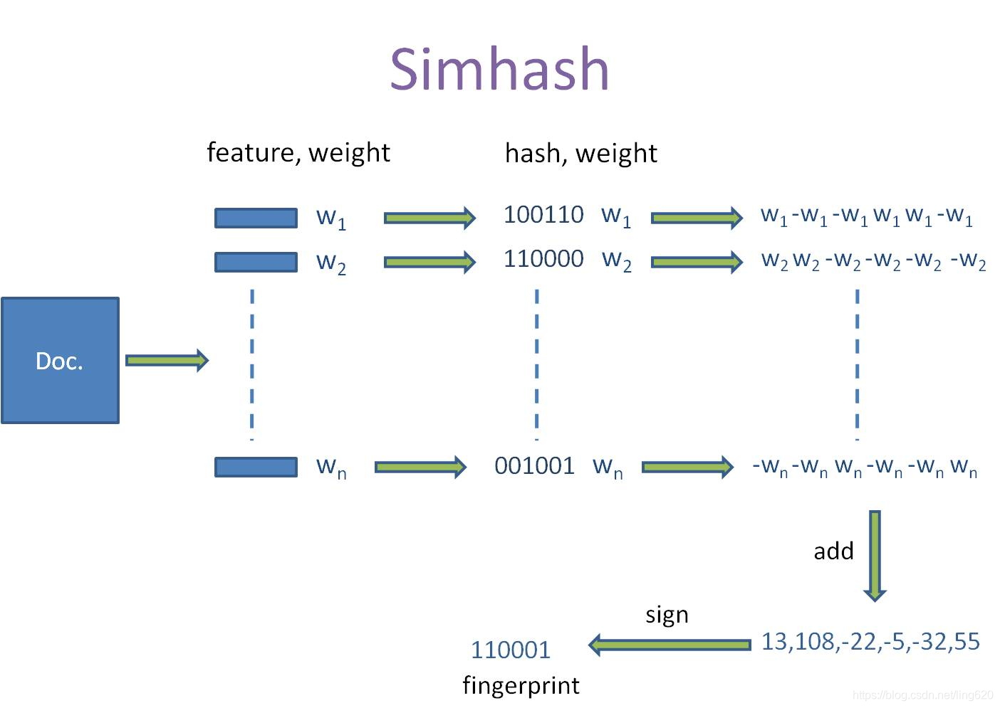
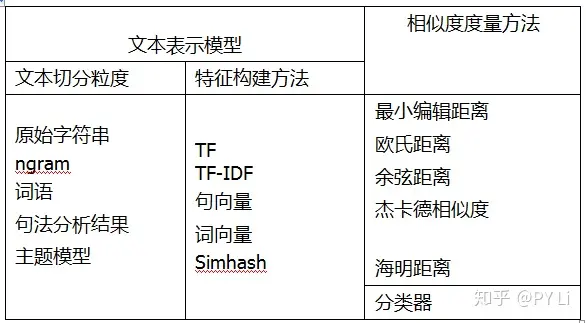

# 文本相似度

文本相似度是指衡量两个文本的相似程度，确定这些文本在内容或表述上的相似程度。

## 应用场景

- 学术论文查重：帮助教育机构检测学术不端行为，如抄袭
- 内容版权保护：防止文章、博客等内容的剽窃
- 文学作品分析：分析作品之间的相似性，或是检查待出版作品与已知作品之间的差异
- 在问答系统中，我们会准备一些经典问题和对应的答案，当用户的问题和经典问题很相似时，系统直接返回准备好的答案；

## 如何计算文本相似度

### Simhash

 SimHash 是**局部敏感哈希**（Locality-Sensitive Hashing, LSH）算法的一种，其主要思想是降维，将高维的特征向量映射成低维的特征向量，再通过比较两个特征向量的**汉明距离**（Hamming Distance）来确定文章之间的相似性。

eg:

**The** quick brown fox jumps over the lazy dog.（敏捷的棕色狐狸跳过了懒狗。）

**A** quick brown fox jumps over the lazy dog.

Simhash 计算结果为：

```
**1100101000100010100110010001110010110100011101011110000000000000
1100101000100011101110010001110010110110011101011110000000000000**
```

**SimHash 流程：**

SimHash 算法总共分为**5**个步骤： 特征提取、hash、加权、合并、降维。

 0. 文本切分

1. 特征提取
将分词后的文本转换为一系列特征，这些特征通常是词汇项
    
    eg: **the**:2, **quick**:1, …
    
2. hash
对每一个特征进行普通的哈希操作，计算 hash 值，这样就得到一个长度为n位的二进制向量（n一般取64）
    
    eg:
    
    **the**:2 → 010111:2
    
    **quick**:1 → 110001:1
    
3. 加权
在获取的hash值的基础上，根据对应的权重值进行加权，即 **W = hash * weight**
    
    eg:（010111:2） ⇒［-2, 2, -2, 2, 2, 2］
    
4. 合并
将上述得到的各个向量的加权结果进行求和，变成只有一个序列串
    
    eg:［-5, 5, -5, 5, 5, 5］、［-3, -3, -3, 3, -3, 3］、［1, -1, -1, 1, 1, 1］进行列向累加得到［-7, 1, -9, 9, 3, 9］
    
5. 降维
对于得到的n-bit签名的累加结果的每个值进行判断，大于0则置为1，否则置为0
    
    eg:［-7, 1,  -9, 9, 3, 9, 1]  ⇒ 010111
    



### 汉明距离

汉明距离为两个**等长字符串**对应位置的不同字符的个数，也就是将一个字符串变换成另外一个字符串所需要**替换**的字符个数。

eg:

**1011101** 与 **1001001** 之间的汉明距离是 2

**build** 和 **buidl** 之间的汉明距离是 3

- **汉明距离 ≤3 认为是相似的**
    
    

### 文本相似度算法

- 文本表示模型：将文本表示为计算机可以计算的数值向量，也就是提供特征；
- 相似度度量方法：基于前面得到的数值向量计算文本之间的相似度



## 参考

- [常见文本相似度计算方法简介](https://zhuanlan.zhihu.com/p/88938220)
- [文本相似度 (Text Similarity)](https://leovan.me/cn/2020/10/text-similarity/)
- [停用词](https://github.com/goto456/stopwords/blob/master/baidu_stopwords.txt)